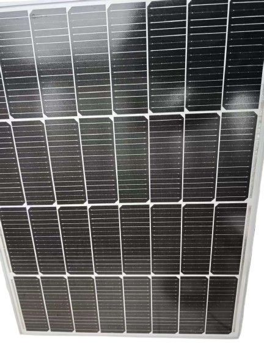
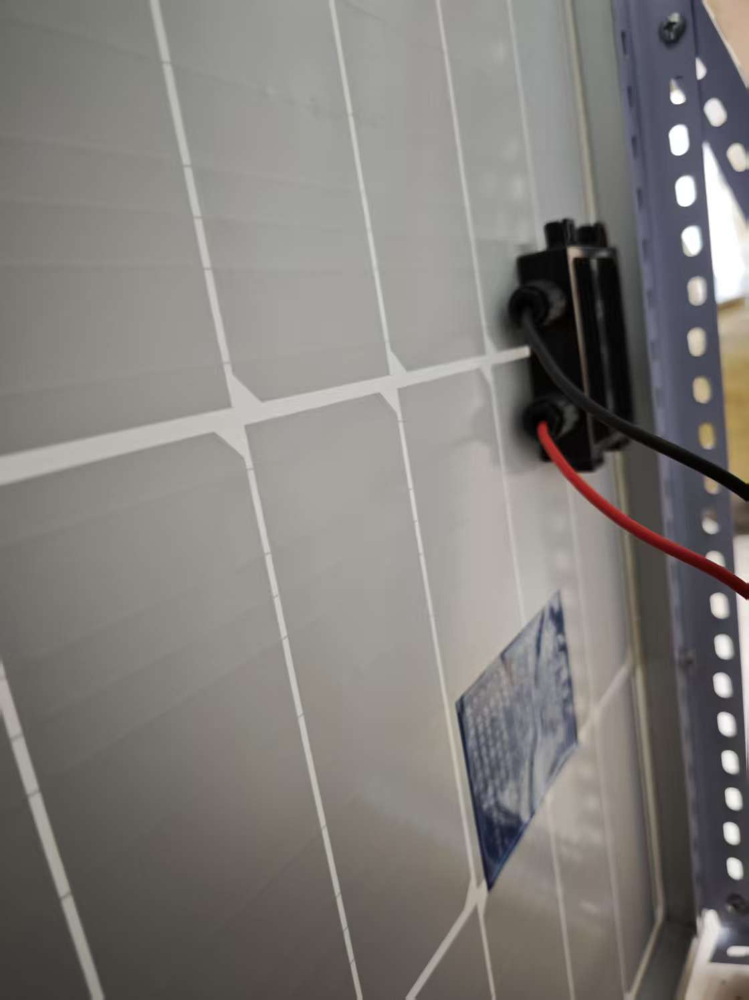
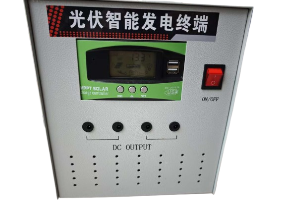
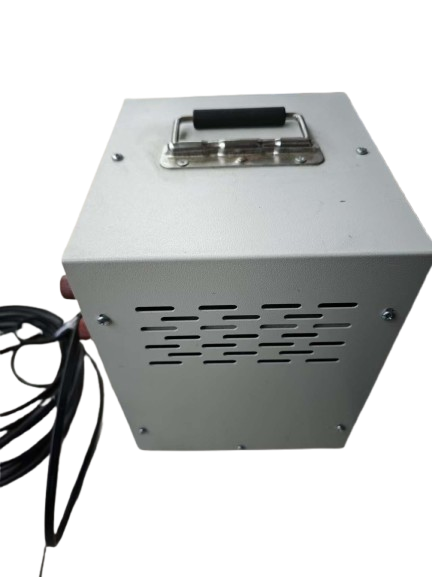
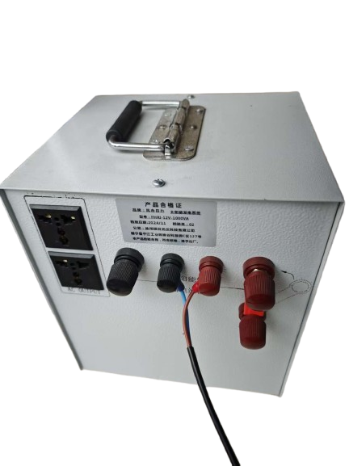

  <h1 align="center">Solar Energy Research</h1>

## Solar Energy Introduction

- **The Existence of Solar Energy:** It does exist and works well
- **The Origin of Solar Energy:** Nuclear Fusion in the Sun's Core
- **The Definition of Solar Energy:** The radiation from the Sun that can be used by human
- **The Principle of Solar Energy:** Photovoltaic Effect
- **The Importance of Solar Energy:** Renewable Energy and Carbon-Free

- We could read [Solar Energy](https://www.britannica.com/technology/solar-cell) to know many details. Next, we will analyze one console to research solar energy.

## Implementing Solar Energy and Solar Generator
- **Another name of Solar Generator :** Solar-Powered Generator
- **The Solar Panel of Solar Generator :** One 100W Solar Panel (7.5KG) with 12V DC
- **The Controller of Solar Generator :** MPPT Solar Charge Controller 12V DC
- **The Battery Packs of Solar Generator （Lithium iron phosphate (LiFePO₄)）:** 65AH
- **The Inverter of Solar Generator :** 1000-watt Rated Power (convert DC to AC)
- **The Improvement of Solar Generator:** Connecting two or three solar panels with a parallel-type circuit that increases solar energy and can not change wattage or voltage
- **Core Function:** After sunrise, the solar panel will generate 12V DC, and the controller will only accept 12V DC and start to charge the battery. The inverter will consume battery capacity and output 220W AC.

- Image:
  
  

    
     
     
     
  

    
     
     
     
     
  

    

  

    
    
  

    

## Summary
This small but not light console (6.5KG) includes power cables, input-output interfaces, and switches.

Our testing result is we could charge all phones, tablets, and laptops, and a fan will be powered. We cannot power space heaters or other high-wattage home appliances.

We will explain resistive loads and inductive loads here. Electric appliances with resistive loads will be powered by rated wattage. Electric appliances with inductive loads will consume more energy and be powered by more wattage (more than rated wattage). Because there are coils and a motor inside it. Our inverter only has 1000 wattage output. It is not enough for daily high-wattage use, and it is our testing console. We need to build a more efficient solar-powered electrical system for our homes if we expect. Like more solar panels, high-capacity batteries, and high-wattage inverters.

If you read our other markdown files, you will have impressions about reactive power compensation. Inductive loads will produce Reactive Power (which never does useful work and wastes energy). Reactive power compensation will reduce reactive power. Our electrical system will use capacitors to neutralize part of inductive reactance.
We could read [Electrical Loads](https://electrical-technology.com/types-of-electrical-loads.html) and [Capacitors](https://electrical-engineering-portal.com/reactive-power-compensation) from here.

Some electrical systems forget to design enough capacitance compensation. They wasted more energy and paid more bills. The solution is to increase capacitance compensation.

Disadvantage:
- We can not charge batteries after sunset. Once we used a 65AH battery, we could not use solar power during this time. We need to think about wind without solar energy. Our console could connect wind turbines with 12V DC.
- We need to clean dirty panels to improve efficiency as well.

Sometimes we will read [Electrical Review](https://electricalreview.co.uk/) to get some news about electrical engineering.
